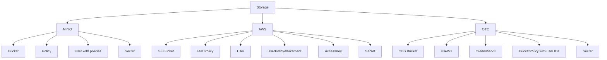

# Provider Storage – Backend Differences

The `Storage` API is the same for MinIO, AWS S3, and OTC OBS, but the resources created behind it are not.

This is the clean abstraction: users work with the same buckets, credentials, access requests, access grants, and lifecycle rules everywhere. Operators choose the backend. Each composition handles the backend-specific identity and policy model.

## Quick View



## Main Differences

### MinIO

- Access is attached directly to the user as a list of policy names.
- The composition can resolve requests and build the final user in one step.

### AWS

- Access uses separate IAM objects:
  - `Policy`
  - `User`
  - `UserPolicyAttachment`
  - `AccessKey`
- AWS needs more steps than MinIO.

### OTC

- Access is not mainly modeled as “attach this named policy to that user”.
- Instead, bucket policies are built with real identity IDs.
- OTC must first observe users and IDs, then build bucket policies from them.

## Why The Compositions Differ

MinIO and AWS S3 are close because both are policy-based user access models.

OTC is different because it is more identity-and-bucket-policy based.

This means:

- MinIO and AWS can share more naming and structure
- OTC must stay different because the backend works differently

## Request Resolution

For MinIO and AWS, access requests are resolved from peer `Storage` objects in the same namespace.

Those owner `Storage` objects must have:

```yaml
metadata:
  labels:
    storages.pkg.internal/discoverable: "true"
```

Only `Storage` objects with at least one discoverable bucket should carry that label.

For OTC, the same label is still a good shared marker for discoverable owners, even though the current OTC composition also needs observed user IDs to build the final bucket policy.
